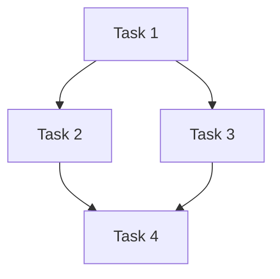

# Task Planner Command

## Purpose

Reviews a phase document from `project-plan/` and creates a detailed task list
in `tasks/`.

## Trigger

Run after `project-planner` has generated a phase document.

## Arguments

- `phase` (optional): Phase number to plan. Defaults to `1`.

## Instrutions

### Step 1: Read Phase Document

Read `.claude/project-plan/phase_{{PHASE}}.md` and extract:

1. **Objectives** - What the phase aims to accomplish
2. **Deliverables** - Specific outputs required
3. **Technical Approach** - Architecture and patterns
4. **Completion Criteria** - How to know when done

### Step 2: Break Down into Tasks

Create atomic, actionable tasks. Each task should:

- Be completable in a single work session
- Have clear acceptance criteria
- Be assignable to a specific agent
- Have defined inputs and outputs

#### Task Categories

1. **Setup Tasks** (Priority: Critical)
   - Directory structure
   - Configuration files
   - Dependencies

2. **Implementation Tasks** (Priority: High)
   - Core functionality
   - Feature development
   - Integration work

3. **Testing Tasks** (Priority: High)
   - Unit tests
   - Integration tests
   - Accessibility tests

4. **Documentation Tasks** (Priority: Medium)
   - Code documentation
   - README updates
   - API documentation

5. **Review Tasks** (Priority: High)
   - Code review
   - Accessibility audit
   - Performance review

### Step 3: Define Task Dependencies

For each task, identify:

- **Predecessors** - Tasks that must complete first
- **Successors** - Tasks blocked by this one
- **Parallel** - Tasks that can run concurrently

### Step 4: Assign Agents

Map tasks to agents based on capabilities:

| Task Type     | Agent   |
| ------------- | ------- |
| Setup         | init    |
| Planning      | planner |
| Coding        | dev     |
| Testing       | test    |
| Documentation | docs    |
| Review        | review  |

### Step 5: Generate Task File

Create `.claude/tasks/phase-{{PHASE}}-tasks.md`:

````markdown
# Phase {{PHASE}} Tasks

Generated: {{TIMESTAMP}} Source: project-plan/phase\_{{PHASE}}.md

## Overview

{{Brief description of what these tasks accomplish}}

## Task Summary

| Status   | Count        |
| -------- | ------------ |
| Total    | {{TOTAL}}    |
| Critical | {{CRITICAL}} |
| High     | {{HIGH}}     |
| Medium   | {{MEDIUM}}   |

## Dependency Graph


````

---

## Tasks

### Critical Priority

#### Task 1: {{TASK_NAME}}

**ID:** PHASE{{PHASE}}-001 **Status:** pending **Agent:** {{AGENT}} **Estimated
Effort:** {{ESTIMATE}} **Dependencies:** None

**Description:** {{Detailed description of what needs to be done}}

**Acceptance Criteria:**

- [ ] {{Criterion 1}}
- [ ] {{Criterion 2}}
- [ ] {{Criterion 3}}

**Deliverables:**

- {{File or artifact 1}}
- {{File or artifact 2}}

**Technical Notes:** {{Any technical guidance or considerations}}

---

### High Priority

#### Task 2: {{TASK_NAME}}

**ID:** PHASE{{PHASE}}-002 **Status:** pending **Agent:** {{AGENT}} **Estimated
Effort:** {{ESTIMATE}} **Dependencies:** PHASE{{PHASE}}-001

...

---

### Medium Priority

...

---

## Execution Order

Recommended execution sequence:

1. **Batch 1 (Parallel)**
   - PHASE{{PHASE}}-001
2. **Batch 2 (After Batch 1)**
   - PHASE{{PHASE}}-002
   - PHASE{{PHASE}}-003
3. **Batch 3 (After Batch 2)**
   - PHASE{{PHASE}}-004

## Completion Checklist

- [ ] All critical tasks complete
- [ ] All high priority tasks complete
- [ ] All tests passing
- [ ] Documentation updated
- [ ] Code reviewed

## Notes

{{Any additional notes or considerations}}

````

### Step 6: Validate Task List

Before saving, validate:

1. **Completeness** - All deliverables have associated tasks
2. **Dependencies** - No circular dependencies
3. **Coverage** - All completion criteria addressed
4. **Assignments** - All tasks have agents

## Output

The command produces:
1. `.claude/tasks/phase-{{PHASE}}-tasks.md` - Detailed task list
2. Console summary of tasks created

## Example Usage

```bash
# Plan tasks for phase 1 (default)
/task-planner

# Plan tasks for a specific phase
/task-planner phase=2
````

## Task Template

Use this template for each task:

```markdown
#### Task {{NUMBER}}: {{NAME}}

**ID:** PHASE{{PHASE}}-{{PADDED_NUMBER}} **Status:** pending **Agent:**
{{AGENT}} **Priority:** {{PRIORITY}} **Estimated Effort:** {{ESTIMATE}}
**Dependencies:** {{DEPS or "None"}}

**Description:** {{Clear description of what needs to be done}}

**Acceptance Criteria:**

- [ ] {{Specific, testable criterion}}

**Deliverables:**

- {{Specific file or artifact}}

**Technical Notes:** {{Implementation guidance}}
```

## Best Practices

1. **Atomic Tasks** - Each task does one thing well
2. **Clear Criteria** - No ambiguity in completion
3. **Realistic Estimates** - Account for complexity
4. **Proper Dependencies** - Enable parallel execution where possible
5. **Agent Alignment** - Match task to agent capabilities
