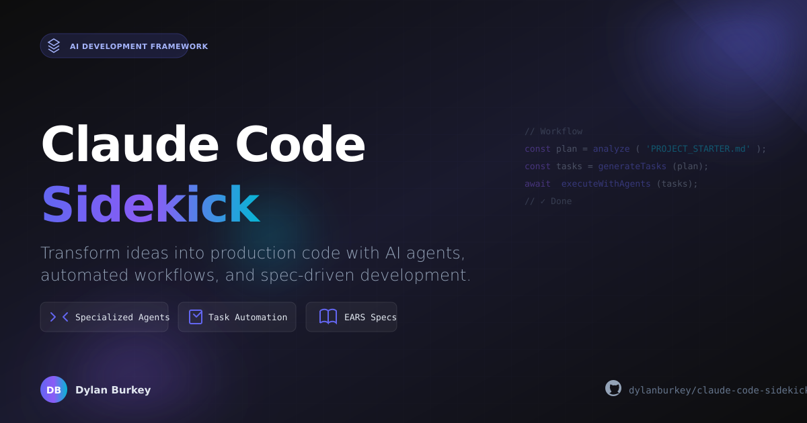

# Claude Code Sidekick

> Complete development framework for AI-assisted coding with Claude.



---

**© 2026 Dylan Burkey. All Rights Reserved.**

---

## Table of Contents

- [How to Use Claude Code Sidekick](#how-to-use-claude-code-sidekick)
  - [Starting a New Project](#starting-a-new-project)
  - [Adding to an Existing Project](#adding-to-an-existing-project)
  - [Using the Multi-Model AI Toolkit](#using-the-multi-model-ai-toolkit)
- [What's Included](#whats-included)
- [Common Workflows](#common-workflows)
- [Documentation](#documentation)
- [Examples](#examples)

---

## How to Use Claude Code Sidekick

### Starting a New Project

**Use this when:** You're starting a fresh project and want a production-ready
setup.

#### Option A: Interactive CLI (Recommended)

```bash
npx create-claude-project
```

The CLI will prompt you to:

1. Choose a project name
2. Select a preset (Static, Astro, React, Next.js, Nuxt, SvelteKit, Full Stack)
3. Pick features (database, auth, analytics, etc.)

**What you get:**

- Complete project scaffold with your chosen framework
- `.claude/` directory with agents, hooks, and rules
- Pre-configured integrations based on your selections
- Git initialized with initial commit
- Ready to run immediately

```bash
# After scaffolding:
cd your-project
npm install
npm run dev
```

#### Option B: Clone and Customize

```bash
# Clone the starter files
git clone https://github.com/dylanburkey/claude-code-sidekick.git
cd claude-code-sidekick

# Edit PROJECT_STARTER.md with your project details
# Then run the quick-start command in Claude Code:
/project-planner
```

---

### Adding to an Existing Project

**Use this when:** You have an existing codebase and want to add Claude Code
Sidekick's features.

#### Step 1: Copy the .claude directory

```bash
# From the claude-code-sidekick repo, copy to your project:
cp -r .claude/ /path/to/your-project/
```

#### Step 2: (Optional) Copy helpful starter files

```bash
# Project planning template
cp PROJECT_STARTER.md /path/to/your-project/

# Or use framework-specific starters:
cp PROJECT_STARTER_WORDPRESS.md /path/to/your-project/
cp PROJECT_STARTER_SHOPIFY.md /path/to/your-project/
```

#### Step 3: Configure for your project

Open your project in Claude Code, then:

```bash
# Set up MCP integrations (databases, cloud, etc.)
/mcp-setup

# Set up automation hooks
/hooks-setup

# Or run quick-start for guided setup
/quick-start
```

#### What you can now do:

| Command            | What it does                                    |
| ------------------ | ----------------------------------------------- |
| `/project-planner` | Create a phased project plan                    |
| `/task-planner`    | Break work into actionable tasks                |
| `/mcp-setup`       | Configure database, cloud, and API integrations |
| `/hooks-setup`     | Set up automated quality checks                 |
| `/status`          | Check project status and progress               |

---

### Using the Multi-Model AI Toolkit

**Use this when:** You want to use multiple AI models (Claude, GPT-4, Gemini,
Venice) together.

The multi-model toolkit lets you:

- Run code reviews with consensus from multiple models
- Intelligently route tasks to the optimal model
- Search your codebase semantically

#### Setup

```bash
cd tools/multi-model
pnpm install

# Add API keys to .env (in project root)
OPENAI_API_KEY=sk-...
ANTHROPIC_API_KEY=sk-ant-...
GEMINI_API_KEY=...
VENICE_API_KEY=...  # Optional: for Venice AI
```

**Note:** You only need ONE API key. The toolkit auto-detects what's available.

#### Code Review (Multiple Models)

```bash
# Quick review (fast, cheap models)
pnpm review -- src/app.js --quick

# Deep review (powerful models)
pnpm review -- src/app.js --deep

# Review multiple files
pnpm review -- src/components/*.tsx
```

Issues are only reported if multiple models agree, reducing false positives.

#### Semantic Code Search

```bash
# Index your codebase
pnpm index -- ./src

# Search by meaning, not keywords
pnpm search -- "authentication logic"
pnpm search -- "error handling middleware"
```

[Full Multi-Model Documentation →](tools/multi-model/README.md)

---

## What's Included

```
claude-code-sidekick/
├── .claude/                    # Core framework
│   ├── commands/              # Built-in commands (/project-planner, etc.)
│   ├── agents/                # 50+ specialized AI agents
│   ├── hooks/                 # 32+ automation hooks
│   ├── mcp/                   # 35+ pre-configured integrations
│   ├── rules/                 # Code style, accessibility, docs standards
│   └── steering/              # Project guidance files
│
├── cli/                       # npx create-claude-project
│
├── agent-library/             # Extended agent collection
│   ├── code-generation/       # Components, APIs, configs
│   ├── task-automation/       # Build, deploy, CI/CD
│   ├── testing/              # Tests, audits, validation
│   ├── documentation/        # Docs, READMEs, changelogs
│   └── blockchain/           # Smart contracts, Web3
│
├── tools/multi-model/         # Multi-model AI toolkit
│
├── examples/                  # Working example projects
│   ├── ssg-starter/          # Astro blog
│   └── crypto-dashboard/     # React + Web3
│
├── docs/                      # Guides and documentation
│
├── PROJECT_STARTER.md         # Generic project template
├── PROJECT_STARTER_WORDPRESS.md
└── PROJECT_STARTER_SHOPIFY.md
```

---

## Common Workflows

### Workflow 1: Start a React/Next.js Project

```bash
# 1. Create project
npx create-claude-project
# Select: Next.js preset, add database, add auth

# 2. Start development
cd my-app
npm install
npm run dev

# 3. Use Claude Code commands
/project-planner    # Plan your features
/task-planner       # Break into tasks
```

### Workflow 2: Add AI Code Review to CI/CD

```bash
# 1. Set up multi-model toolkit
cd tools/multi-model
pnpm install

# 2. Add to pre-commit hook
cp examples/pre-commit-hook.js .git/hooks/pre-commit
chmod +x .git/hooks/pre-commit

# 3. Code is now reviewed before each commit
```

### Workflow 3: Set Up Database + Auth for Existing Project

```bash
# 1. Copy .claude to your project
cp -r .claude/ /your-project/

# 2. Run MCP setup in Claude Code
/mcp-setup

# 3. Select: Neon (database), Supabase (auth)
# 4. Add keys to .env
# 5. Done - integrations are configured
```

### Workflow 4: Build a Web3 DApp

```bash
# 1. Create with CLI
npx create-claude-project
# Select: React preset, add Web3 features

# 2. Or use the example
cd examples/crypto-dashboard
npm install
npm run dev
```

### Workflow 5: Improve Code Quality on Legacy Project

```bash
# 1. Add Claude Code Sidekick
cp -r .claude/ /legacy-project/

# 2. Set up hooks
/hooks-setup
# Enable: pre-commit validation, auto-format, lint

# 3. Run multi-model review on critical files
cd tools/multi-model
pnpm review -- /legacy-project/src/critical-module.js --deep
```

---

## Documentation

### Getting Started

- [CLI Guide](docs/guides/cli-guide.md) - Using `npx create-claude-project`
- [Quick Start](docs/guides/quick-start-guide.md) - 5-minute setup
- [Beginner's Guide](docs/guides/beginner-guide.md) - Complete introduction

### Tutorials

- [Build a Static Site (SSG)](docs/guides/real-world-example-ssg.md) -
  Step-by-step with screenshots
- [Nuxt Full-Stack App](docs/guides/nuxt-fullstack-walkthrough.md)
- [Python FastAPI](docs/guides/python-fastapi-walkthrough.md)
- [Web3 DApp with Privy](docs/guides/web3-dapp-privy-walkthrough.md)

### Multi-Model AI

- [Multi-Model Toolkit](tools/multi-model/README.md) - Full documentation
- [Consensus Code Review](tools/multi-model/README.md#multi-model-code-review)
- [Semantic Search](tools/multi-model/README.md#semantic-code-search)

### Reference

- [All Commands](.claude/commands/)
- [All Agents](agent-library/README.md)
- [All MCP Integrations](.claude/mcp/README.md)
- [All Hooks](.claude/hooks/README.md)
- [Troubleshooting](docs/guides/troubleshooting.md)

---

## Examples

### SSG Starter (Astro Blog)

```bash
cd examples/ssg-starter
npm install
npm run dev
# → http://localhost:4321
```

A production-ready static site with blog, SEO, and modern CSS.

### Crypto Dashboard (React + Web3)

```bash
cd examples/crypto-dashboard
npm install
npm run dev
# → http://localhost:5173
```

Web3 landing page with wallet auth and signature verification.

---

## Why Claude Code Sidekick?

| Feature                     | Cursor/Copilot | Claude Code Sidekick              |
| --------------------------- | -------------- | --------------------------------- |
| Code completion             | ✅             | Uses Claude Code                  |
| Project scaffolding         | ❌             | ✅ Full CLI                       |
| Pre-configured integrations | ❌             | ✅ 35+ MCPs                       |
| Automated workflows         | ❌             | ✅ 32+ hooks                      |
| Multi-model AI              | ❌             | ✅ Claude + GPT + Gemini + Venice |
| Specialized agents          | ❌             | ✅ 50+ agents                     |

**Use together:** Cursor/Copilot for inline suggestions + Sidekick for
structure, automation, and multi-model capabilities.

---

## Quick Reference

### Essential Commands

```bash
# In Claude Code:
/quick-start       # Guided setup
/project-planner   # Create project plan
/task-planner      # Break into tasks
/mcp-setup         # Configure integrations
/hooks-setup       # Set up automation
/status            # Check progress
```

### Multi-Model CLI

```bash
# In tools/multi-model/:
pnpm review -- <file>          # Code review
pnpm index -- <directory>      # Index codebase
pnpm search -- "query"         # Semantic search
```

### Environment Variables

```bash
# .env
OPENAI_API_KEY=sk-...          # For GPT models
ANTHROPIC_API_KEY=sk-ant-...   # For Claude
GEMINI_API_KEY=...             # For Gemini
VENICE_API_KEY=...             # For Venice AI
USE_MULTI_MODEL=TRUE           # Enable multi-model (default)
```

---

## License

MIT License - See [LICENSE](LICENSE) for details.

---

**Get started in 2 minutes:**

```bash
npx create-claude-project
```

[Documentation](docs/) | [Examples](examples/) | [Agent Library](agent-library/)
