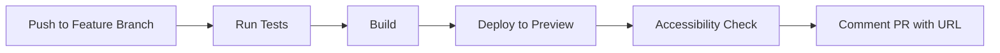
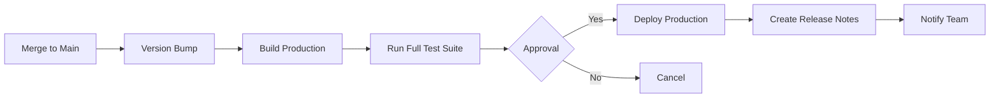
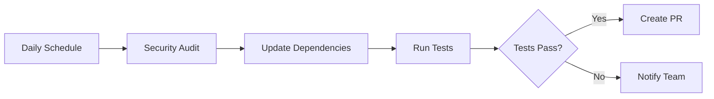

# Task Automation Agents

> Agents that automate repetitive development tasks and streamline workflows.

## Overview

Task automation agents handle the routine, repetitive tasks that slow down
development. From building and deploying to file organization and dependency
management, these agents free you to focus on creative problem-solving.

## Available Agents

### Build Automation

- **Build Pipeline**: Automated build processes with optimization
- **Asset Optimizer**: Compress images, minify CSS/JS, optimize fonts
- **Bundle Analyzer**: Analyze and optimize bundle sizes

### Deployment Automation

- **CI/CD Runner**: Automated continuous integration and deployment
- **Environment Manager**: Manage staging, production environments
- **Release Automator**: Versioning, changelog, and release notes

### File Management

- **File Organizer**: Organize files by type, feature, or convention
- **Import Sorter**: Sort and organize import statements
- **Dead Code Eliminator**: Find and remove unused code

### Dependency Management

- **Dependency Updater**: Keep dependencies current and secure
- **Package Auditor**: Security audits and vulnerability fixes
- **License Checker**: Verify license compatibility

## Usage Patterns

### Simple Automation

```markdown
Run the build pipeline and optimize all assets
```

### Scheduled Tasks

```markdown
Set up daily dependency security audits and create PRs for updates
```

### Complex Workflows

```markdown
Create a deployment workflow that:

1. Runs all tests
2. Builds for production
3. Runs accessibility audits
4. Deploys to staging
5. Runs smoke tests
6. Awaits approval
7. Deploys to production
8. Posts to Slack
```

## Best Practices

### Task Design

1. **Idempotent**: Tasks should be safely re-runnable
2. **Atomic**: Each task does one thing completely
3. **Logged**: All actions should be logged for debugging
4. **Reversible**: Provide rollback where possible

### Error Handling

```javascript
// Good error handling in automation
try {
  await deployToProduction();
} catch (error) {
  await rollbackDeployment();
  await notifyTeam(error);
  throw error;
}
```

### Notifications

Keep teams informed:

- Start/end of important tasks
- Errors and failures
- Success confirmations
- Manual approval requests

## Agent Configuration

### Build Configuration

```yaml
agent: task-automation/build-pipeline
config:
  steps:
    - lint
    - type-check
    - test
    - build
  parallel: true
  failFast: true
  notifications:
    slack: '#dev-notifications'
```

### Deployment Configuration

```yaml
agent: task-automation/deployment
config:
  environments:
    - name: staging
      branch: develop
      auto: true
    - name: production
      branch: main
      approval: required
  healthChecks:
    enabled: true
    retries: 3
```

## Examples

### Example 1: Automated Build

**Scenario:** Every commit should trigger a build with tests

**Configuration:**

```yaml
trigger: commit
steps:
  - name: Install
    run: npm ci
  - name: Lint
    run: npm run lint
  - name: Test
    run: npm test
  - name: Build
    run: npm run build
  - name: Report
    notify: true
```

### Example 2: Dependency Updates

**Scenario:** Weekly dependency updates with automated testing

**Configuration:**

```yaml
schedule: weekly
steps:
  - name: Check Updates
    run: npm outdated
  - name: Update
    run: npm update
  - name: Test
    run: npm test
  - name: Create PR
    if: tests-pass
    title: 'chore: update dependencies'
```

### Example 3: Asset Optimization

**Scenario:** Optimize all images before deployment

**Configuration:**

```yaml
trigger: pre-deploy
files: 'src/**/*.{jpg,png,svg}'
steps:
  - name: Compress Images
    tool: sharp
    quality: 85
  - name: Generate WebP
    formats: [webp, avif]
  - name: Update References
    auto: true
```

## Integration with MCP

Automation agents leverage MCP for:

- **Database Migrations**: Automated schema updates via Neon MCP
- **Resource Management**: File and API resource access
- **State Persistence**: Track automation state across runs
- **External Integrations**: Connect to third-party services

### MCP Example

```javascript
// Deploy automation with database migration
async function deployWithMigration() {
  // Run database migration via MCP
  await mcp.neon.prepareDatabaseMigration({
    projectId: 'project-id',
    migrationSql: migrationScript,
  });

  // Deploy application
  await deployApplication();

  // Complete migration
  await mcp.neon.completeDatabaseMigration({
    migrationId: 'migration-id',
    applyChanges: true,
  });
}
```

## Common Workflows

### Workflow 1: Feature Branch Deploy



### Workflow 2: Production Release



### Workflow 3: Scheduled Maintenance



## Hooks and Triggers

### Pre-Commit Hooks

```yaml
hook: pre-commit
tasks:
  - lint-staged
  - type-check
  - test-affected
```

### Post-Deploy Hooks

```yaml
hook: post-deploy
tasks:
  - smoke-tests
  - health-check
  - notify-team
  - update-docs
```

### Scheduled Tasks

```yaml
schedule: '0 9 * * MON' # Every Monday at 9 AM
tasks:
  - dependency-audit
  - lighthouse-score
  - bundle-size-check
  - update-dashboard
```

## Monitoring and Logging

### Task Logging

```javascript
const logger = createTaskLogger('build-pipeline');

logger.start('Building application');
logger.step('Running tests', { count: testFiles.length });
logger.success('Build completed', { duration: '2m 34s' });
logger.error('Build failed', { error: errorMessage });
```

### Performance Tracking

```javascript
const metrics = {
  startTime: Date.now(),
  steps: [],
  totalDuration: null,
  success: false,
};

// Track each step
metrics.steps.push({
  name: 'lint',
  duration: '15s',
  success: true,
});
```

## Rollback Strategies

### Automatic Rollback

```javascript
async function deployWithRollback() {
  const checkpoint = await createCheckpoint();

  try {
    await deploy();
    await runHealthChecks();
  } catch (error) {
    await rollbackToCheckpoint(checkpoint);
    throw error;
  }
}
```

### Manual Rollback

```bash
# Provide easy rollback commands
npm run rollback:production
npm run rollback:staging <version>
```

## Security Considerations

- **Secrets Management**: Never hardcode credentials
- **Access Control**: Limit permissions to minimum required
- **Audit Trails**: Log all automated actions
- **Approval Gates**: Require manual approval for production

## Troubleshooting

### Task Hangs or Times Out

- Add timeout configurations
- Check for blocking operations
- Review resource limits

### Inconsistent Results

- Ensure idempotent operations
- Clear caches between runs
- Verify environment consistency

### Permission Errors

- Check service account permissions
- Verify API tokens and keys
- Review access control lists

## Contributing

To add a new automation agent:

1. Define clear trigger conditions
2. Document all steps and dependencies
3. Include error handling and rollback
4. Add monitoring and logging
5. Provide usage examples
6. Test in multiple environments

## Resources

- [Agent Template](../templates/agent-template.md)
- [CI/CD Best Practices](../../docs/ci-cd-guide.md)
- [Security Guidelines](../../docs/security.md)

---

_Task automation agents eliminate toil and ensure consistent, reliable workflows
across your development pipeline._
